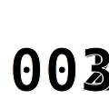

# Frame by Frame Animations: SVG Set vs. CSS Animation

The goal is to generate a frame by frame animation that switches between
an ordered set of images at an acceptable frame rate. We can leverage the
Inkscape application to generate the frame elements. But rather than render
the images to a sequence of PNG files we want a way to quickly play the
animation in the web browser. We can achieve this using animatable
attributes on HTML Elements.

There are multiple options for creating declarative animations using HTML
elements. SVG is a subset of HTML used to define graphical elements. The
SVG specification defines a subset of the SMIL specification to provide
animation of SVG elements. CSS3 introduced animation properties to provide
similar features for elements outside of SVG. For this research we will
ignore non-declarative methods of producing animations using JavaScript or
embedded media.

## SVG Set Element

The set element can be used to switch between frames by defining
relations between multiple set elements associated with each frame element.

We define 3 set elements for each frame to represent the three states.

- Initial
  - Frame not displayed
- On
  - Frame is displayed
- Off
  - Frame not displayed

Each set element state affects the value of the display attribute.

The begin attribute can accept a time reference to another set element's
end time. We make use of this to transistion between the 3 states after a
specified duration.

- Initial Duration
  - The length of time from start of frame sequence until first display
- On Duration
  - The length of time to display each frame (preferrably a constant value)
- From Duration
  - The length of time from when the frame stops displaying until the end
      of the whole frame sequence

To loop the entire animation we can set every initial state to begin both
at time 0 and at the off state of the last frame.

Try this simple example in the browser:

    <svg width="120" height="120"  viewBox="0 0 120 120"
        xmlns="http://www.w3.org/2000/svg" version="1.1"
        xmlns:xlink="http://www.w3.org/1999/xlink">

        <g id="frame_001">
            <set
                id="init_001"
                begin="0ms; off_003.end"
                dur="0ms"
                attributeName="display"
                to="none" />
            <set
                id="on_001"
                begin="init_001.end"
                dur="100ms"
                attributeName="display"
                to="inline" />
            <set
                id="off_001"
                begin="on_001.end"
                dur="200ms"
                attributeName="display"
                to="none" />
            <text
                id="frametext_001"
                stroke="white"
                style="font:bold 64.0px monospace">
                <tspan
                    x="10"
                    y="100"
                    id="frametspan_001">001</tspan>
            </text>
        </g>

        <g id="frame_002">
            <set
                id="init_002"
                begin="0ms; off_003.end"
                dur="100ms"
                attributeName="display"
                to="none" />
            <set
                id="on_002"
                begin="init_002.end"
                dur="100ms"
                attributeName="display"
                to="inline" />
            <set
                id="off_002"
                begin="on_002.end"
                dur="100ms"
                attributeName="display"
                to="none" />
            <text
                id="frametext_002"
                stroke="white"
                style="font:bold 64.0px monospace">
                <tspan
                    x="10"
                    y="100"
                    id="frametspan_002">002</tspan>
            </text>
        </g>

        <g id="frame_003">
            <set
                id="init_003"
                begin="0ms; off_003.end"
                dur="200ms"
                attributeName="display"
                to="none" />
            <set
                id="on_003"
                begin="init_003.end"
                dur="100ms"
                attributeName="display"
                to="inline" />
            <set
                id="off_003"
                begin="on_003.end"
                dur="1ms"
                attributeName="display"
                to="none" />
            <text
                id="frametext_003"
                stroke="white"
                style="font:bold 64.0px monospace">
                <tspan
                    x="10"
                    y="100"
                    id="frametspan_003">003</tspan>
            </text>
        </g>

    </svg>

## CSS Animation Attributes

The CSS animation can be used to switch between frames by defining
an @keyframes at-rule and animation attributes for each frame element.

Similar to set elements the @keyframes is used to define the states for
the frame. The difference is that we define the attributes that are
affected at a percentage of the duration of the animation.

Try this example in the browser:

    <svg width="120" height="120"  viewBox="0 0 120 120"
        xmlns="http://www.w3.org/2000/svg" version="1.1"
        xmlns:xlink="http://www.w3.org/1999/xlink">
        
        <g id="frame_001">
            <text
                id="frametext_001"
                stroke="white"
                style="font:bold 64.0px monospace">
                <tspan
                    x="10"
                    y="100"
                    id="frametspan_001">001</tspan>
            </text>
        </g>

        <g id="frame_002">
            <text
                id="frametext_002"
                stroke="white"
                style="font:bold 64.0px monospace">
                <tspan
                    x="10"
                    y="100"
                    id="frametspan_002">002</tspan>
            </text>
        </g>

        <g id="frame_003">
            <text
                id="frametext_003"
                stroke="white"
                style="font:bold 64.0px monospace">
                <tspan
                    x="10"
                    y="100"
                    id="frametspan_003">003</tspan>
            </text>
        </g>

    </svg>
